<picture>
  <source media="(prefers-color-scheme: dark)" srcset="dark_mode.svg">
  <source media="(prefers-color-scheme: light)" srcset="light_mode.svg">
  
</picture>

<picture>
  <source media="(prefers-color-scheme: dark)" srcset="top_dark.svg">
  <source media="(prefers-color-scheme: light)" srcset="top_light.svg">
  
</picture>
